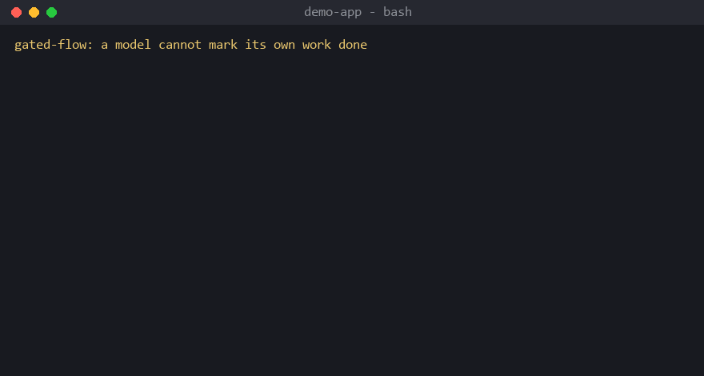

# flow — an evidence-gated development workflow for coding agents

[](https://github.com/rct-labs/gated-flow/actions/workflows/validate.yml)
[](LICENSE)
[](https://skills.sh/rct-labs/gated-flow)



Four skills and one small engine that let a coding agent shape an idea into a
testable spec, queue small verifiable tasks, run them unattended, and prove
each one closed — without ever letting a model mark its own work done.

| Entry | You say | What happens |
|---|---|---|
| **flow-run** | `$flow-run [claude\|codex\|kimi\|grok]` | **Start here.** Host CLI inspects the project, decides the next slice, writes the queue, then runs it unattended; it loads the two skills below as it goes |
| **flow** | `$flow <idea, question, or "tidy up">` | Planning only, runs nothing: survey the code, shape a brief and spec, queue admission-ready tasks, hand off a session, audit the tree (read-only) |
| **run-queue** | `$run` | The queue is already written and you only want it run: `gate.py` runs one worker process per task, verifies each with the project's own acceptance command, stops at the first thing that needs a human |
| **model-debate** | `$model-debate <draft>` | Role-based seats on two or more distinct models research, critique and cross-examine a draft; the host verifies every claim against evidence before freezing it |

The sigil differs per CLI (`/flow` in Claude Code and Grok Build, `$flow` in
Codex, `/skill:flow` in Kimi Code); the skill names are identical everywhere.

## Why

Unattended agents converge on a specific lie: a commit that flips a task to
DONE while touching only the queue file. The engine in `gate/` closes that hole
mechanically — a git `pre-commit` hook derives the verdict from the diff and the
acceptance command's exit code, so there is no field to lie in. Everything else
here (admission control, journal narration, stage and impact checks) is
built on that one property. `docs/design.md` is the contract.

Development and module batches run scoped checks; integration adds interface
checks; delivery runs complete acceptance. Ordinary defects are recorded and
batched at checkpoints, while safety and due acceptance defects block the
affected scope. Repair reviews check original defects and direct regressions,
not the entire system again. See [the stage policy](docs/autonomy.md).

## How the pieces fit

```text
  you ──$flow──▶ brief.md / spec.md ──▶ TASK_QUEUE.md (+ scope lines)
                                              │
                          $flow-run ──────────┤  host CLI decides the next slice
                                              ▼
  $run ──▶ flow admit ──▶ gate.py run ──▶ one worker process per task
                              │                 │
                              │        pre-commit hook: diff + exit code
                              ▼                 ▼
                       .gate/journal.ndjson   DONE only when the gate lets the commit through
                              │
                   RUN-REPORT.md → "Waiting on you" (empty on a clean run)

  $model-debate ──▶ only for a fork that is uncertain, high-impact and hard to undo
```

## Repository layout

```text
skills/
  flow/            interactive entry (SKILL.md)
  flow-run/        inspect → decide → queue → run
  run-queue/       unattended execution and narration
  model-debate/    multi-model evidence-first review (+ references/)
flow/              the `flow` command: flow.py, audit.py, templates/
gate/              the engine: gate.py, launch-detached.ps1, supervise.ps1,
                   watch-journal.sh, selftest.sh, unit tests, README.md
docs/              usage.md (manual), design.md (contract), autonomy.md (unattended half)
examples/          a small model-debate fixture you can inspect offline
scripts/           verify_repository.py (whitelist + English-only + integrity check)
publish-manifest.json   the explicit list of published files
```

## Install

Requires Python 3.10+ and git. The engine is stdlib-only.

```bash
git clone https://github.com/rct-labs/gated-flow.git
cd gated-flow
bash install.sh               # every skill → ~/.claude/skills, ~/.codex/skills, ~/.agents/skills; `flow` shim in ~/.local/bin
```

On Windows, `pwsh -File install.ps1` links one canonical copy per skill instead
of copying it three times. Both installers accept `--skill <name>` /
`-Skill <name>`, `--agent` / a destination filter, `--no-shim`, and
`--uninstall`. They replace a same-name skill directory at each destination.

The [skills CLI](https://github.com/vercel-labs/skills) also discovers the
skills (it installs skills only, not the `flow` command):

```bash
npx skills add rct-labs/gated-flow --list
npx skills add rct-labs/gated-flow --skill flow-run --skill flow --skill run-queue --skill model-debate
```

As a Claude Code plugin (skills only, namespaced `gated-flow:flow` etc.):

```text
/plugin marketplace add rct-labs/gated-flow
/plugin install gated-flow@rct-labs
```

Then, once per project:

```bash
flow init --repo . --verify-cmd "<the command that exits non-zero when the project is broken>"
flow doctor --repo .
```

`flow init` only creates what is missing (`TASK_QUEUE.md`, `CONTEXT.md`,
`.gate/config.json`, the pre-commit hook) and never overwrites. Leave
`--verify-cmd` empty and admission refuses every task with `no-oracle` until
you set one — loud beats a guessed oracle.

## Daily loop

1. **Have an idea** → `$flow …`. The agent surveys the code, discusses in small
   rounds, writes `docs/work/<id>/brief.md` and `spec.md`, appends queue rows
   with scope lines, and shows the admission report.
2. **Let it run** → `$flow-run` (the host decides the next slice, queues it
   and runs it), or `$run` when the queue is already written. The run is detached from the chat session, narrated from the
   journal, and ends with `RUN-REPORT.md`; read its **Waiting on you** section.
3. **Switch sessions** → `$flow hand off`. `CONTEXT.md` (≤200 lines, five
   questions) is the handoff; nothing else.

`docs/usage.md` is the full manual, including queue format, admission states,
stop reasons and troubleshooting.

## Platform notes

- Developed and exercised on Windows 11 with Claude Code, Codex, Kimi Code and
  Grok Build. Detached unattended runs use Windows Task Scheduler and `pwsh`
  (`gate/launch-detached.ps1`, `gate/supervise.ps1`).
- The engine itself is portable Python; `gate/selftest.sh` and the unit tests
  run under Git Bash. A foreground or `nohup python gate/gate.py run …` on
  macOS/Linux runs the same loop but has not been exercised by the authors.
- Worker and reviewer model names (`codex`, `kimi`, `grok`, `fable`) are
  configuration defaults in `.gate/config.json` (`workers`, `worker_cmds`,
  `judge.chain`, `judge_cmds`); pin whatever your subscriptions serve. The
  `pi` worker runs any OpenRouter model named in `worker_models.pi`. Every
  headless call is a real request against your own subscriptions.
- `model-debate` resolves model identities at runtime from CLI metadata and
  requires two provably distinct models; see `skills/model-debate/README.md`.
- The command is named `flow`. If another `flow` (for example Facebook's Flow
  type checker) is already on your PATH, the installer warns; put `~/.local/bin`
  ahead of it or call `python <checkout>/flow/flow.py` directly.

## Validate

```bash
python scripts/verify_repository.py      # whitelist, English-only, paths, links, frontmatter, parse checks
bash gate/selftest.sh                    # 11 gate cases in a throwaway repo
python -m unittest discover -s gate -p "test_*.py" -q
python examples/model-debate/evidence.py
```

CI runs the same checks. No test makes a real model call.

## Maintenance

- `publish-manifest.json` lists every published file; the verifier fails on
  anything present but unlisted, so adding a file is a deliberate act.
- Skill entry points stay short; details live in `references/` or `docs/`.
- Behavioral changes to the engine come with a selftest case or a unit test
  that goes red when the feature is removed.

## Feedback

Issues that name the skill, the CLI and its version, a reproducible input, and
the expected versus observed result are the most useful. Remove private material
before sharing a transcript or a `.gate/` log. If this workflow spares you one
fake completion, star the repository so others can find it.

## License

[MIT](LICENSE). Dependencies and fonts, where any are used, keep their own
licenses.
